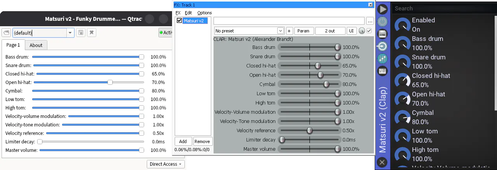

Matsuri v2.0
============

Synthesizer recreating the sound of Roland's TR-606 drum machine. Fast, tiny, and faithful to the original sounds (considering that it doesn't emulate circuitry). The project includes:

- CLAP plug-in
	- With velocity affecting both volume and timbre (configurable), optional limiter, volume controls, choking between hats, and each sound being unique.
- Web Audio / WebAssembly [AudioNode](https://developer.mozilla.org/en-US/docs/Web/API/AudioNode)
	- Same capabilities as CLAP plug-in. It also works lovely with [Web MIDI API](https://developer.mozilla.org/en-US/docs/Web/API/Web_MIDI_API).
- FLAC samples with an SFZ definition
	- For old-school musicians, they are more rigid: 4 velocities only. SFZ definition implements volume controls, and choking.

[*] Matsuri has no relation with Roland, all trademarks and copyrights are theirs.


Download
--------
[Here the latest release](https://github.com/baAlex/Matsuri/releases/latest)


Guide for CLAP Plug-in
----------------------

### Installation

1 - Check that your DAW supports CLAP plug-ins, and where it expects them to be installed. At the time of writing, a common location on Windows is *'C:\Program Files\Common Files\CLAP\'*, on Linux *'~/.clap/'* (yes, with a dot).

2a - **Windows users**, in the ZIP file you will find a file named *'matsuri-v2.clap'*, copy it into the folder your DAW expects it. Restart the DAW, some may require you to explicitly indicate to "Scan" new plug-ins; read its documentation

2b - **Linux users**, in the ZIP file you will find *'matsuri-v2-fedora.clap'* and *'matsuri-v2-ubuntu.clap'*, these files were compiled in Fedora 44 and Ubuntu 24.04 LTS respectively, choose one according to your distro. Are you using something different? Chances are that either of them will do the job. Copy it into the folder your DAW expects it. Restart the DAW, some may require you to explicitly indicate to "Scan" new plug-ins; read its documentation

3 - And that is it! You should find *Matsuri v2* as an instrument, and/or a drum machine.


### Using It

There is no pretty graphical interface, your DAW is in charge of displaying parameters. You will find something like:



Aside from typical volume parameters, a limiter is provided, disabled when decay is set to zero (the default). "Velocity reference" specifies the velocity to converge to if "Velocity-tone modulation" approaches zero. With no "Velocity-volume modulation" volume converges to 100%.

The synthesizer will respond to notes B1 through C#3 (35-49 following General MIDI standard). All sounds can play simultaneously, however, each one is monophonic when retriggered. Exceptions are the open and closed hi-hat, which silence one another, and crash cymbal which is fully polyphonic.


Guide for Web Audio
-------------------

### Installation

For the moment there's no automated deployment of any kind, you have two options:

- Use latest release ZIP (I recommend this), you will find a precompiled WASM module with its JS companions.
- Compile the WASM module manually, with *clang*, and *cmake*.

Regardless of which method you choose, you will find yourself with following files:

| Filename                | Function |
| ----------------------- | - |
| matsuri-v2.wasm         | WASM module, there is not much you can do with it. |
| matsuri-v2-worklet.js   | Glue between JS and WASM, a boring file. |
| matsuri-v2.js           | *This is the important one*, what might be called the library/module. It defines `MatsuriV2Node` class (a Web Audio node), and it is in charge of fetching and initialise the worklet. *You absolutely should modify this file in order to better integrate it into your framework* (it is under public domain). |
| test-page-v2.html       | Minimal example that showcases the synth, ugly but gets things done. |


### Quick Test

Got the files?, run this command in your terminal:

```
python3 -m http.server 8000 --directory [FOLDER WITH ABOVE FILES]
```

Then go into your browser, usually at address `http://0.0.0.0:8000/` (this information should be in the terminal). Choose the test page and everything should work, use the buttons on screen, or keys Z, X, N, M, G, J, L; or connect your MIDI keyboard.

> [!WARNING]
> Do not simply double click the HTML file, your browser will refuse to fetch required files. You need to set a local server.


### Common Operations

**Initialisation** is:
```js
import * as matsuri from "./matsuri-v2.js";

let ctx = new AudioContext();

// Tell the audio context what "Matsuri" is
await matsuri.FetchAndRegister(ctx);

// Maybe you want to fetch specifying these two:
// await matsuri.FetchAndRegister(ctx, "./matsuri-v2-worklet.js", "./matsuri-v2.wasm");

// Create and connect a Matsuri node
let node = new matsuri.MatsuriV2Node(ctx);
node.connect(ctx.destination);

// Node will start playing, but in silence, as no note has been sent
```

To **send a note**:
```js
// Any of them (or all of them, to test polyphony):
// 0.5 = Velocity, use range [0, 1]
node.noteOn(matsuri.MIDI_BASS_DRUM_KEY, 0.5);
node.noteOn(matsuri.MIDI_ACOUSTIC_SNARE_KEY, 0.5);
node.noteOn(matsuri.MIDI_LOW_FLOOR_TOM_KEY, 0.5);
node.noteOn(matsuri.MIDI_LOW_MID_TOM_KEY, 0.5);
node.noteOn(matsuri.MIDI_CLOSED_HI_HAT_KEY, 0.5);
node.noteOn(matsuri.MIDI_OPEN_HI_HAT_KEY, 0.5);
node.noteOn(matsuri.MIDI_CRASH_CYMBAL_KEY, 0.5);
```

> [!WARNING]
> Put any of these under the click of a button, or a key press. Browsers will refuse to play sounds without user interaction. Do not send the first note automatically, for example at page loading. After first note tho, any automation is allowed.

To **adjust parameters** it follows Web Audio API:
```js
let parameter = node.parameters.get("volume-bass-drum");
parameter.setValueAtTime(value, ctx.currentTime);
```

You can **send MIDI messages** directly (follows General MIDI standard), so wiring with Web MIDI API is as simple as call `node.midi()` on new messages:
```js
navigator.requestMIDIAccess().then(access => {
	for (const input of access.inputs.values()) {
		input.onmidimessage = msg => {
			node.midi(msg.data[0], msg.data[1], msg.data[2]);
		}
	}
});
```

### Using It

These are available parameters, with their default, minimum, and maximum values. They behave identically to the native plug-in:

| Parameter name               | Default value | Minimum | Maximum |
| ---------------------------- | ------------- | ------- | ------- |
| `volume-bass-drum`           | 100           | 0       | 100     |
| `volume-snare-drum`          | 100           | 0       | 100     |
| `volume-closed-hi-hat`       | 65            | 0       | 100     |
| `volume-open-hi-hat`         | 70            | 0       | 100     |
| `volume-cymbal`              | 80            | 0       | 100     |
| `volume-low-tom`             | 100           | 0       | 100     |
| `volume-high-tom`            | 100           | 0       | 100     |
| `velocity-volume-modulation` | 1             | 0       | 1       |
| `velocity-tone-modulation`   | 1             | 0       | 1       |
| `velocity-reference`         | 0.5           | 0       | 1       |
| `limiter-decay`              | 0 ms          | 0 ms    | 1000 ms |
| `master-volume`              | 100           | 0       | 100     |


Requirements
------------

### For the Plug-in
- Processor: Intel/AMD x86-64 or compatible.
- OS: Windows 10, 11, or compatible (Wine works lovely); Fedora 44, Ubuntu 24.04, or compatible (some offer a Linux layer).

This thing runs on a potato, however if you want to run it on older Windows versions, you will need to install UCRT (Universal C Runtime).

### For Web Audio
- Compatibility with WASM, at the time of writing all mainstream browsers support it.
- Compatibility with Web Audio API, according to [MDN](https://developer.mozilla.org/en-US/docs/Web/API/Web_Audio_API) it is the case of mainstream browsers since 2021. It is possible to run the WASM module without this API, however, achieve real-time rendering will be rather hard.


Technical Details
-----------------
- Format: Float 32 (IEEE 754 Single Precision), both output and internal maths.
- Channels: Fake stereo, it copies a single signal to both left, and right channels. This is in order to support DAWs that only handle stereo.
- Output will normally be in the -1,+1 range, exceeding it if sounds overlap. A normal behaviour as actual decibels and clipping depends on your DAW or browser. If needed, provided limiter will enforce a strict -1,+1 range.
- No noise/dither of any kind is added, no internal step suffers from quantisation. Your DAW should add it if required (when doing a 16-bits mix for example).


Compile From Source Code
------------------------
1a - **Windows users**, you need a *C11 compiler*, *cmake*, and *git*. Latter two are easy to install, type in the terminal:

```
winget install -e --id Kitware.CMake Git.Git
```

Now for the compiler, visit [www.visualstudio.microsoft.com](https://visualstudio.microsoft.com/), it can be a rather interesting ride. If that is the case you may find the LLVM/Clang suite easier to install, you can get a installer from [www.github.com/llvm/llvm-project/releases](github.com/llvm/llvm-project/releases).

1b - **Linux users**, you need a *C11 compiler*, *cmake*, and *git*. On Ubuntu you can install these by typing in the terminal:

```
sudo apt install gcc cmake git
```

2 - Then, download the code with its dependencies using *git*, and enter the folder using:

```
git clone --recurse-submodules https://github.com/baAlex/Matsuri
cd Matsuri
```

3 - Once in the folder, it is usual *cmake* stuff:

```
mkdir build
cd build
cmake .. -DCMAKE_BUILD_TYPE=Release
cmake --build .
```

> [!NOTE]
> You may want to compile without optimisations, for this, remove the argument: `-DCMAKE_BUILD_TYPE=Release`


License And Terms
-----------------
Matsuri is free and open source, under Common Development and Distribution License 1.0.

Samples and audio created from code/programs, under no license, those are yours.
